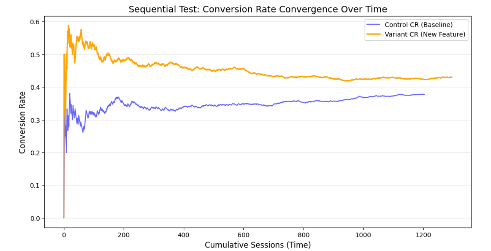
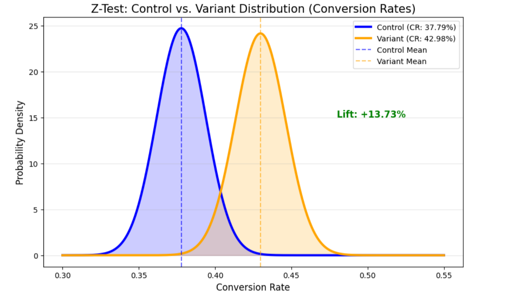
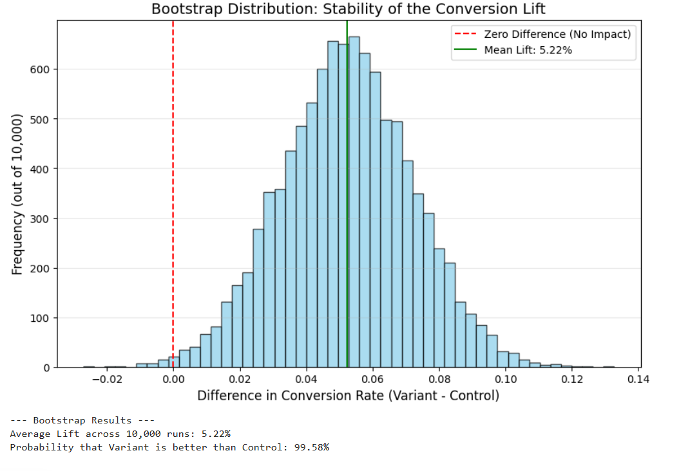
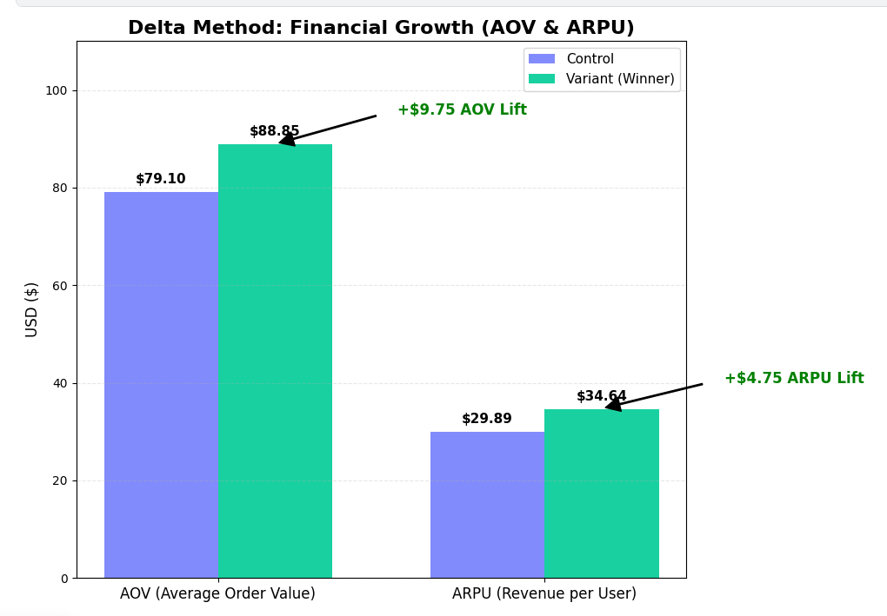
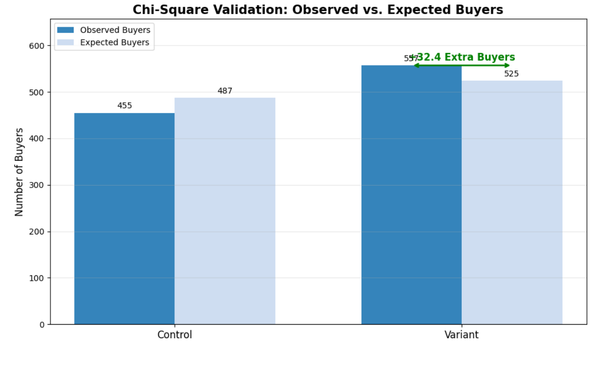

# 🧪 E-Commerce A/B Test: Optimizing Checkout for Revenue Growth
### *Statistical Validation & Financial Impact Analysis of UI/UX Interventions*

## 📌 Project Overview
This project evaluates the performance of a new checkout feature through a rigorous A/B testing framework. Moving beyond surface-level conversion metrics, I employed **Sequential Testing**, **Bootstrap Resampling**, and the **Delta Method** to validate financial lift and ensure the statistical stability of results before recommending a full-scale product rollout.

---

## 📈 Phase 1: Real-Time Monitoring & Convergence
To avoid the common pitfall of "peaking" at false positives, I utilized **Sequential Testing** to monitor the conversion rate as data accumulated. This ensured that the experiment reached a stable state before final conclusions were drawn.

*Figure 1: Real-time convergence of Conversion Rates across cumulative sessions.*

---

## 📊 Phase 2: Statistical Rigor & Lift Validation
I conducted a multi-stage validation using a **Z-Test** to measure immediate impact and **Bootstrap Distribution** to ensure the stability of the lift across 10,000 simulated runs.

*Figure 2: Probability density showing a significant **+13.73% conversion lift** for the Variant group.*

*Figure 3: Bootstrap results confirming a **99.58% probability** that the Variant outperforms the Control.*

---

## 💰 Phase 3: Financial Growth Analysis (The Delta Method)
Product success is ultimately measured by financial impact. I applied the **Delta Method** to calculate the lift in Average Order Value (AOV) and Revenue Per User (ARPU) while accounting for the variance inherent in ratio metrics.

*Figure 4: Financial impact analysis illustrating substantial growth in core revenue metrics.*

---

## 🔍 Final Validation: Chi-Square Observed vs. Expected
To conclude the analysis, a **Chi-Square test** was performed to compare observed buyer behavior against statistical expectations.

*Figure 5: Comparison confirming the Variant produced **32.4 extra buyers** beyond expectation.*

---

## 💡 Strategic Conclusion
Based on the **99.58% probability of success** and the documented **+$9.75 lift in AOV**, the feature is cleared for a 100% traffic rollout. 

---

## 🛠️ Technical Stack
* **Statistical Frameworks:** Z-Test, Chi-Square Validation, Bootstrap Resampling (10k iterations).
* **Advanced Analytics:** Delta Method for AOV/ARPU variance estimation, Sequential Testing.
* **Languages & Tools:** Python (Scipy, Statsmodels), Matplotlib, SQL (Metric Extraction).
